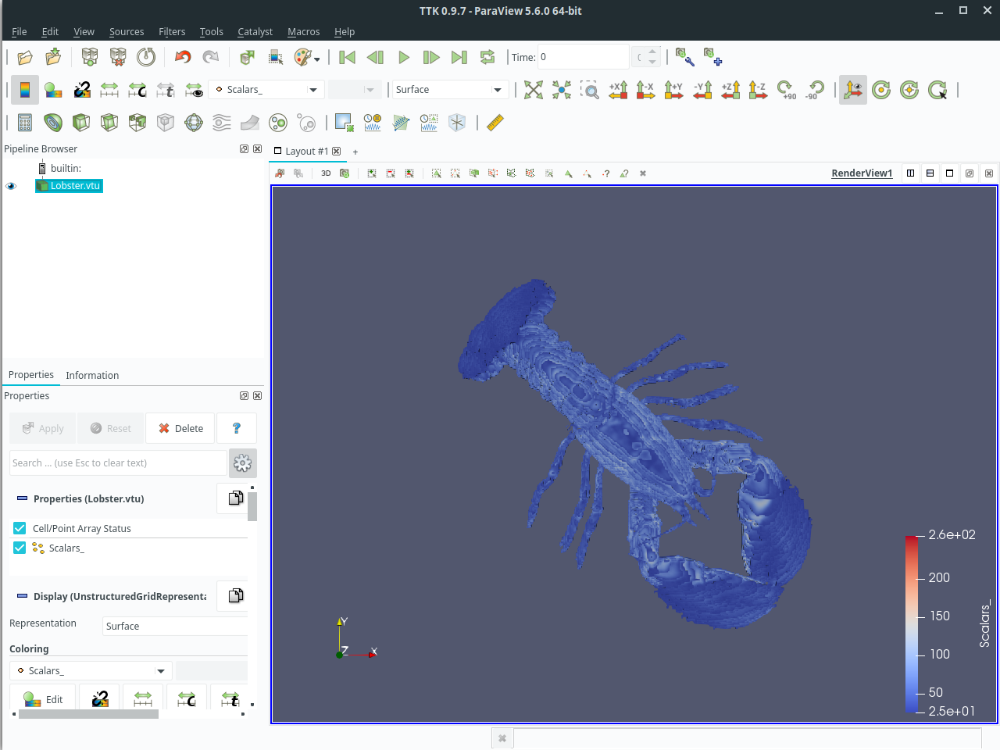
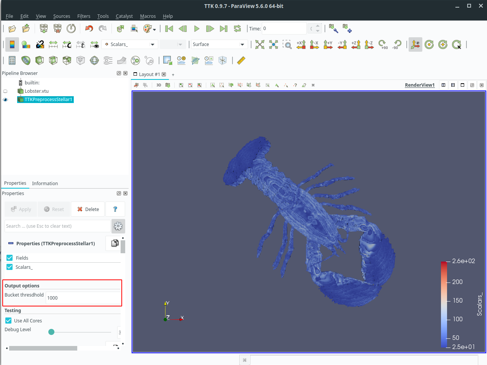

# TopoCluster

TopoCluster is a new localized data structure for tetrahedral meshes, which provides efficient computation of the connectivity of the mesh elements with a low memory footprint. 


## Introduction

The data structure is proposed in the paper *TopoCluster: A Localized Data Structure for Topology-based Visualization* that was submitted to *IEEE Transactions on Visualization and Computer Graphics*.

The purposes of some folders in the repository are explained here.
- Folder `Datasets` contains some example datasets to try TopoCluster data structure.
- Folder `ParaView-v5.6.0` folder contains [ParaView](https://www.paraview.org/) version 5.6.0, and it can be downloaded from [here](https://www.paraview.org/download/).
- Folder `ttk-0.9.7` contains the [Topology Toolkit](https://topology-tool-kit.github.io/index.html) 0.9.7 with only necessary plugins to run TopoCluster. The full package of TTK can be downloaded from [here](https://topology-tool-kit.github.io/downloads.html).


## Installation

TopoCluster is developed under Topology Toolkit (TTK) framework. To use TopoCluster, TTK and ParaView need to be installed.

The following installation steps are based on [TTK offical installation guide](https://topology-tool-kit.github.io/installation-0.9.7.html) under Ubuntu Linux distribution.


### 1. Downloads
Use `git clone` to clone the repository.

### 2. Installing the dependencies
Please enter the following commands (omit the `$` character) in a terminal to install dependencies.

```
$ sudo apt-get install cmake-qt-gui
$ sudo apt-get install libvtk7-dev
$ sudo apt-get install qt5-default qttools5-dev libqt5x11extras5-dev
```
### 3. Configuring, building and installing ParaView
Use `cd` command to change the current working directory to the project root when executing the following commands! 

#### Configuration 
To enter the configuration menu of ParaView's build, enter the following commands:

```
$ cd ./ParaView-v5.6.0/
$ mkdir build
$ cd build
$ cmake-gui ../
```

Click on the "Configure" button to proceed. Once the configuration is finished, please tick the "Advanced" check box and set the following variables as follows (required for TTK's installation):
- `CMAKE_BUILD_TYPE=Release`
- `PARAVIEW_ENABLE_PYTHON=ON`
- `PARAVIEW_INSTALL_DEVELOPMENT_FILES=ON`
- `VTK_PYTHON_VERSION=3`

Next, click on the "Generate" button and close the configuration window when the generation is completed.

#### Build 
Use `make -jN` command to start the compilation process, when `N` is the number of available cores on your system (this will take a **LONG** time).

#### Installation
Use `sudo make install` to install the build of ParaView on your system. 

### 4. Configuring, building and installing TTK
Use `cd` command to change the current working directory to the project root when executing the following commands! 

#### Configuration
To enter the configuration menu of ParaView's build, enter the following commands:

```
$ cd ./ttk-0.9.7/
$ mkdir build
$ cd build
$ cmake-gui ../
```

Click on the "Configure" button to proceed. Then, click on the "Generate" button. Once the generation is completed, close the configuration window.

As introduced in the paper, TopoCluster provides two instances. Explicit TopoCluster prioritizes time efficiency and provides only a modest savings in memory usage, while Implicit TopoCluster drastically reduces memory consumption up to an order of magnitude with the cost of time efficiency. 

Note: You can choose to build Explicit TopoCluster by setting `ENABLE_IMPLICIT_TOPOCLUSTER` to `OFF` (default) and to build Implicit TopoCluster by setting `ENABLE_IMPLICIT_TOPOCLUSTER` to `ON`. The parallel version can be built by selecting `TTK_ENABLE_OPENMP` checkbox.

#### Build 
Use `make -jN` command to start the compilation process, when `N` is the number of available cores on your system (this will take a **LONG** time).

#### Installation
Once the build is finished, use `sudo make install` to install your build of TTK on your system. After this, you have successfully installed TopoCluster.

## How to Use

### Overview

Explicit and Implicit TopoCluster are implemented in `ttk-0.9.7/core/base/explicitTopoCluster` and `ttk-0.9.7/core/base/implicitTopoCluster` respectively. To use TopoCluster structure, the input dataset needs to contain an array named "**_index**" which denotes the cluster index of each point in the dataset. 

In this repository, we provide a plugin called `ttkPreprocessStellar` that uses a clustering technique based on Point Region (PR) octree. The clustering results are saved into the "_index" array. 

In `Datasets` folder, we have the original tetrahedral mesh of a lobster (`Lobster.vtu`) and the one with the indexing field (`Lobster_1000.vtu` where 1000 denotes the bucket threshold of the PR octree). 

### Step-by-step Guide

1. Open ParaView in the terminal by using `paraview` command. Load the lobster dataset by selecting `File -> Open` and choosing `Lobster.vtu` in `Datasets`.


2. Select `Lobster.vtu` in `Pipeline Browser`, use shortcut `Ctrl + Space` to search the plugin `TTK PreprocessStellar` and press `Enter` to select. (Another option is through `Filters -> TTK - Misc -> TTK PreprocessStellar`.) The bucket threshold for the PR octree can be configured in the Properties panel of the plugin.


3. After preprocessing the dataset, select `TTKPreprocessStellar1` in `Pipeline Browser`, and apply the plugin `TTK TestTopoCluster` using the same approach mentioned in the last step. In the Properties panel, make sure the `Scalar Field` is the desired scalar field other than `_index`. The cache ratio can be set from 0 to 1.


4. Check the output from the terminal. The plugin should print out the time usage for each relational operator and the memory usage for the computation.


