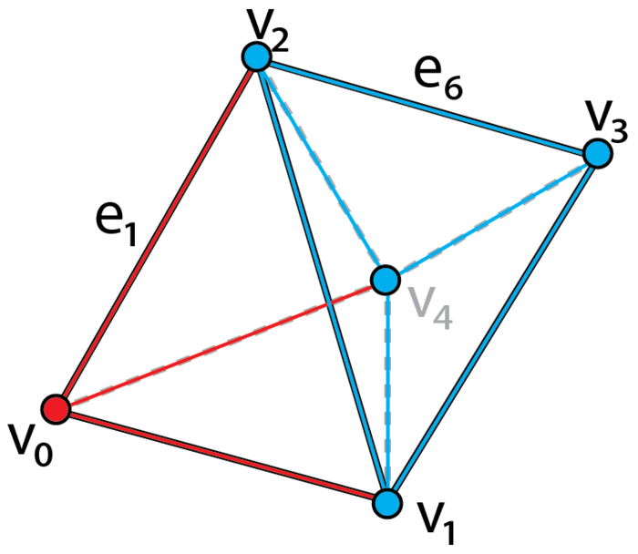
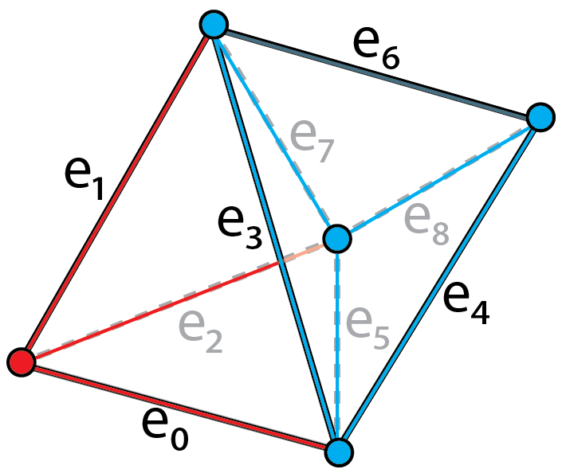
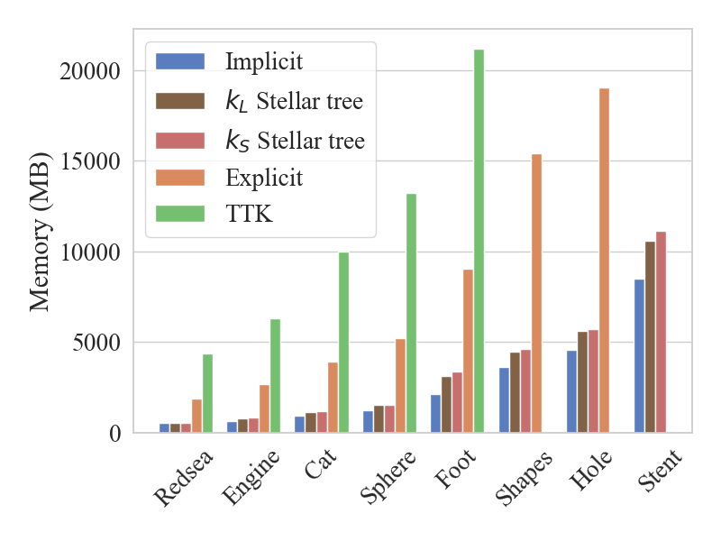
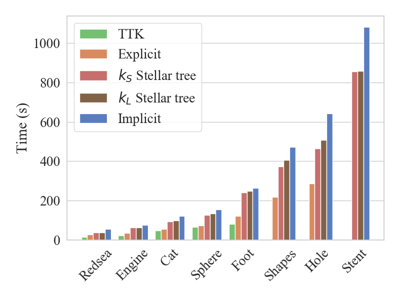
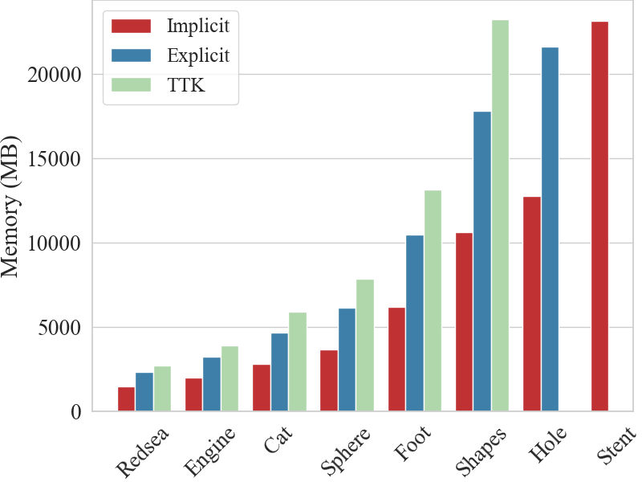
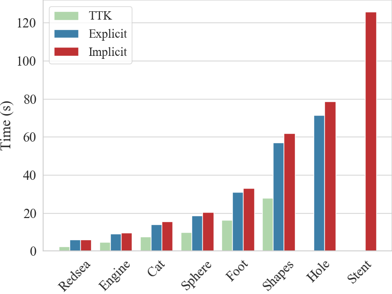
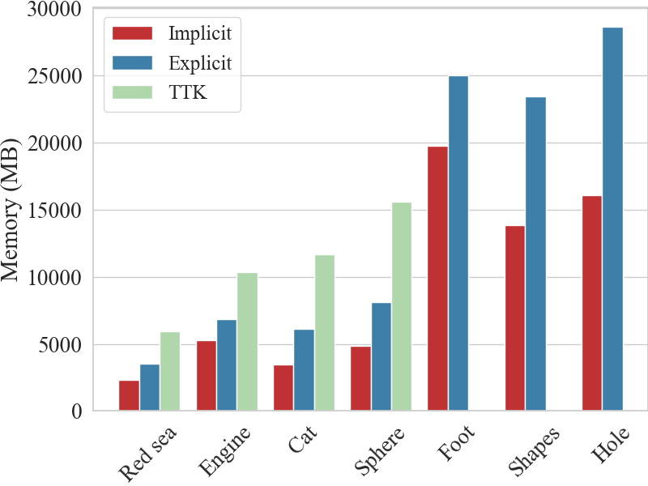
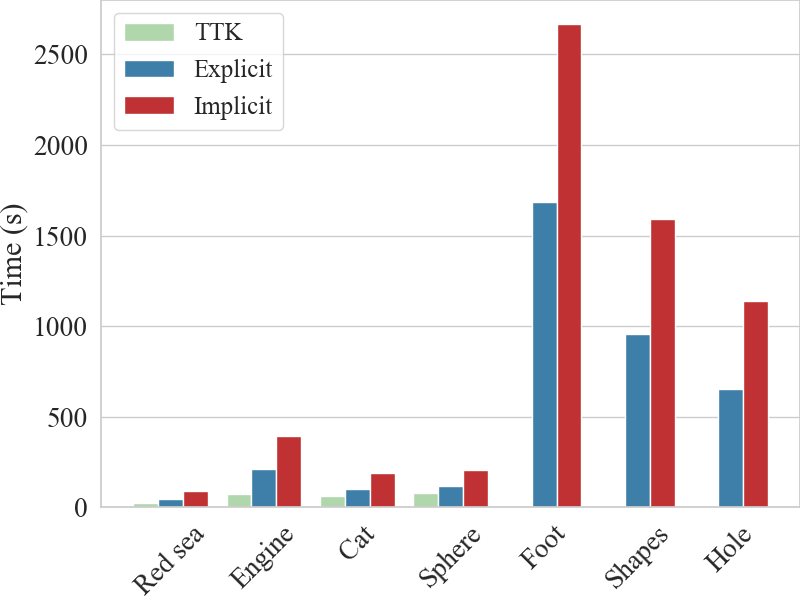

[Link to the paper](https://doi.org/10.1109/TVCG.2021.3121229)

## Introduction
Unstructured data are collections of points with irregular topology, often represented through simplicial meshes, such as triangle and tetrahedral meshes. Whenever possible such representations are avoided in visualization since they are computationally demanding if compared with regular grids. In this work, we aim at simplifying the encoding and processing of simplicial meshes. 

In the paper, we proposes TopoCluster, a new localized data structure for tetrahedral meshes, which can provide efficient computation of the connectivity of the mesh elements with a low memory footprint. 

There are two instances of TopoCluster: 
- Explicit TopoCluster prioritizes time efficiency and provides only a modest saving in memory
- Implicit TopoCluster drastically reduces memory consumption up to an order of magnitude with respect to comparable data structures. 

## TopoCluster 
TopoCluster inherits the localized approach for extracting relational operators from the Stellar decomposition, but aims at enumerating all the simplices of the simplicial complex through an _enumeration schema_. 

**Cluster-based enumeration.** 

|  |  | 
|:-|:-|
| *An example tetrahedral mesh that is formed by two clusters which are distinguished by red and blue separately. The vertices and edges are subdivided accordingly.* | *Enumeration of the edges of the tetrahedral mesh.* |

The cluster-based enumeration is obtained by enforcing the following rules:
- $k$-simplices internal to a cluster $c$ are enumerated within a closed interval $[l, u]$, where $u - l + 1$ is the number of $k$-simplices internal to $c$;
- For any pair of clusters, the corresponding intervals do not overlap. As a consequence, for any pair of clusters $c_i$ , $c_j$ , with $i < j$, $k$-simplices in $c_j$ have indices greater than those in $c_i$.

### Explicit TopoCluster
The global layer of Explicit TopoCluster includes:
- input tetrahedral mesh represented though two arrays, array $V$ encodes the coordinates of each vertex and array $TV$ stores the boundary vertices of each tetrahedron;
- input subdivision encoded with an array storing the cluster index of each vertex in the simplicial mesh,
- enumeration schema which encodes the edges and triangles in the mesh with two hash tables,
- and the list of simplices intersecting each cluster defined in the input subdivision.

The local layer is where relational operators are computed and stored. Once a relational operator for a simplex $\sigma$ is required, TopoCluster locates the cluster $c_i$ containing $\sigma$, computes the relational operators of the simplices internal to $c_i$, and returns the relational operator of $\sigma$.

### Implicit TopoCluster
[Explicit TopoCluster](#explicit-topocluster) fully encodes the enumeration of edges and triangles with two hash tables $E$ and $F$. However, in *Implicit TopoCluster*, instead of encoding the two hash tables $E$ and $F$ in the global layer, the indexing of edges and triangles is computed on-the-fly when accessing a cluster.

## Results

### 1. Computing Relational Operators
We compare the performance of the four data structures for extracting relational operators. We start by computing all relational operators involving vertices. Then, we move to edges, triangles, and tetrahedra.

Memory Comparison             |  Timing Comparison
:-------------------------:|:-------------------------:
  |  

Compared to TTK Triangulation, memory usage decreases by **three times** when using Explicit Triangulation. Implicit Triangulation is always **the most compact** data structure, requiring **10% less** memory than the Stellar tree.

Considering the execution time, Implicit TopoCluster is always the slowest at extracting relational operators. It requires **up to 20% more** time more than the Stellar tree, **70% more** time than the Explicit, and it is **twice slower** than TTK triangulation. 

### 2. Computing Scalar Field Critical Poin
Some plugin visits simplices in a sequential order following the enumeration schema. As a consequence, TopoCluster will access clusters in the same sequential order. We select *TTKScalarFieldCriticalPoints* as an example of a plugin of this kind.

Memory Comparison             |  Timing Comparison
:-------------------------:|:-------------------------:
  |  

Implicit TopoCluster uses **60%** of the memory required by Explicit TopoCluster, and TTK triangulation requires **twice** the memory of Implicit structure, where it goes out of memory on the three larger datasets. 

Regarding the time usage, TTK Triangulation is **1.8 times** faster than Explicit TopoCluster and **two times** faster than Implicit TopoCluster. 

### 3. Computing Morse Smale Complex
Some plugins visit simplices in a pseudo-random fashion which will force TopoCluster to visit clusters in a random order, possibly initializing the same cluster multiple times. We select *TTKMorseSmaleComplex* as an example of a plugin of this kind.

Memory Comparison             |  Timing Comparison
:-------------------------:|:-------------------------:
  |  

TTK Triangulation uses about **twice** the memory required by Explicit TopoCluster and can only run on the four smaller datasets.

As for the run time comparison, on the four datasets for which TTK triangulation can complete the extraction, Implicit TopoCluster is **four times** slower, while Explicit TopoCluster is **two times** slower than TTK triangulation.
